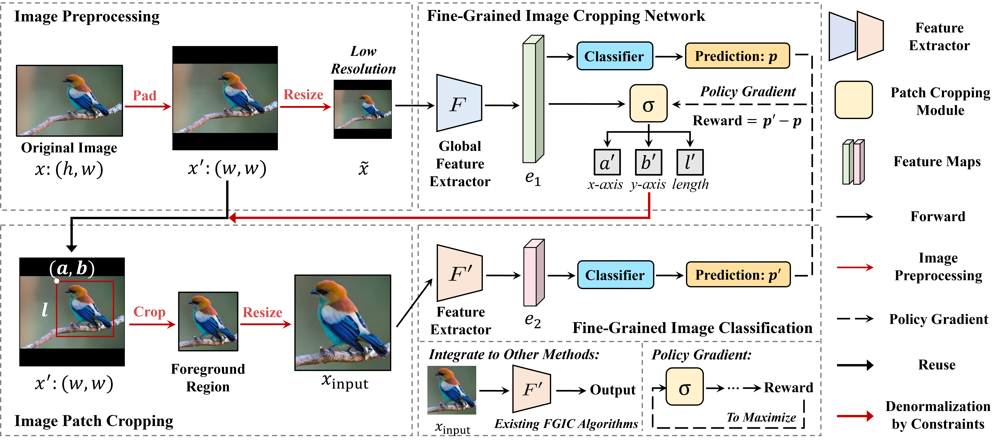

# FCNet

Code release for FCNet: Extracting Undistorted Images for Fine-Grained Image Classification.

<p align="center">
    
</p>


### Requirement
 
python 3.8

PyTorch >= 1.3.1

torchvision >= 0.4.2

### Training

1. Download datatsets for FGVC (e.g. CUB-200-2011, Standford Cars, FGVC-Aircraft, etc) and organize the structure as follows:
```
dataset
├── train
│   ├── class_001
|   |      ├── 1.jpg
|   |      ├── 2.jpg
|   |      └── ...
│   ├── class_002
|   |      ├── 1.jpg
|   |      ├── 2.jpg
|   |      └── ...
│   └── ...
└── test
    ├── class_001
    |      ├── 1.jpg
    |      ├── 2.jpg
    |      └── ...
    ├── class_002
    |      ├── 1.jpg
    |      ├── 2.jpg
    |      └── ...
    └── ...
```

2. Train the Stage-1 of FCNet with `python Birds.py` in `FCNet_Training`

3. Train the Stage-2 of FCNet with `python Birds.py` in `FCNet_Training` by setting `--train_stage` to `default=2`

4. Train ResNet-50 integrated with FCNet with `python Birds.py` in `FT_ResNet_FCNet`

## Contact
Thanks for your attention!
If you have any suggestion or question, you can leave a message here or contact us directly:
- chenjunhan@bupt.edu.cn
- changdongliang@pris-cv.cn
