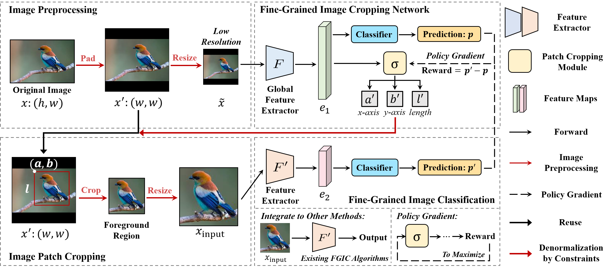

# FCNet

Code release for FCNet: Extracting Undistorted Images for Fine-Grained Image Classification

### Introduction

<p align="center">
    
</p>

In typical training frameworks like TensorFlow and PyTorch, images are usually resized into square dimensions at a specific resolution using bilinear interpolation or similar techniques. While this step standardizes input sizes, the process can severely distort critical image regions, making it harder to observe the fine details. 

Ultramarine Flycatchers and Little Kingfishers belong to different biological orders, exhibit significant interclass differences. The two species are distinguished by their beak length. The crude application of resizing increases the difficulty of discrimination by compromising these critical regions, which is unacceptable in fine-grained tasks. 
<p align="center">
    
</p>


### Requirement
 
python 3.9

PyTorch >= 1.3.1

torchvision >= 0.4.2

### Training

1. Download datatsets for FGVC (e.g. CUB-200-2011, Standford Cars, FGVC-Aircraft, etc) and organize the structure as follows:
```
dataset
├── train
│   ├── class_001
|   |      ├── 1.jpg
|   |      ├── 2.jpg
|   |      └── ...
│   ├── class_002
|   |      ├── 1.jpg
|   |      ├── 2.jpg
|   |      └── ...
│   └── ...
└── test
    ├── class_001
    |      ├── 1.jpg
    |      ├── 2.jpg
    |      └── ...
    ├── class_002
    |      ├── 1.jpg
    |      ├── 2.jpg
    |      └── ...
    └── ...
```

2. Train the Stage-1 of FCNet with `python Birds.py` in `FCNet_Training`

3. Train the Stage-2 of FCNet with `python Birds.py` in `FCNet_Training` by setting `--train_stage` to `default=2`

4. Train ResNet-50 integrated with FCNet with `python Birds.py` in `FT_ResNet_FCNet`

## Contact
Thanks for your attention!
If you have any suggestion or question, you can leave a message here or contact us directly:
- chenjunhan@bupt.edu.cn
- changdongliang@bupt.edu.cn
